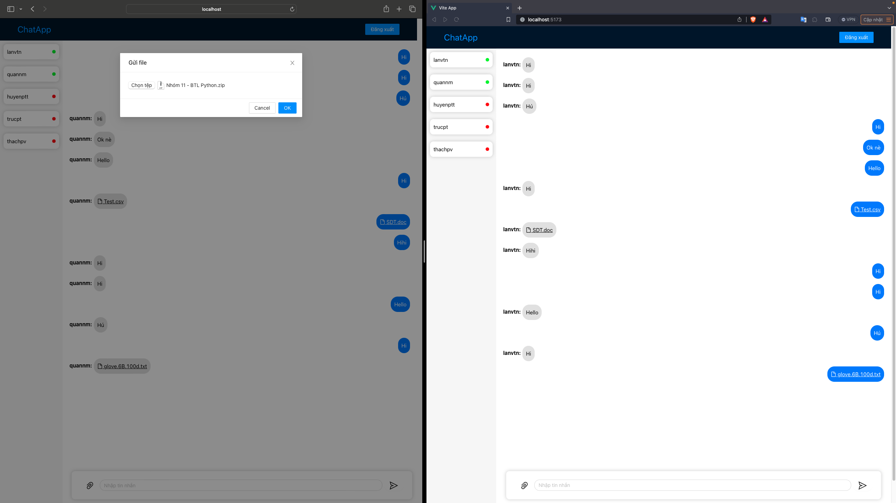

# Bài tập lớn môn Lập trình mạng - Nhóm 02

  

## Đề tài: Ứng dụng chat real-time

  

**Danh sách thành viên:**

  

1. Phạm Thị Thanh Huyền - B20DCCN334.

2. Vũ Thị Ngọc Lan - B20DCCN387.

3. Nguyễn Mạnh Quân - B20DCCN550.

  

---

  

### I. Mô tả

#### 1. Giới thiệu

  

Ứng dụng Chat Realtime là một ứng dụng cho phép người dùng trò chuyện với nhau trong thời gian thực. Ứng dụng này được phát triển để cung cấp trải nghiệm trò chuyện dễ dàng và nhanh chóng, cho phép người dùng gửi tin nhắn, hình ảnh và tệp đính kèm một cách nhanh chóng.

  

#### 2. Các tính năng chính

  
**Đăng nhập và đăng ký:** Ứng dụng cho phép người dùng đăng nhập bằng tên đăng nhập và mật khẩu hoặc đăng ký tài khoản mới.

**Trò chuyện Real-time:** Người dùng có thể trò chuyện với nhau một cách trong thời gian thực, không cần phải làm mới trang hoặc tải lại.
 

**Gửi Tệp Đính Kèm** **:** Người dùng có thể gửi tệp đính kèm như tài liệu, hồ sơ và tệp âm thanh.


  

#### 3. Demo các tính năng

  

*Màn hình chính và giao diện login*

  


  

*Chatspace*

  


*Gửi file bất đồng bộ*





### II. Các công nghệ sử dụng

  

**Back-end**

  

1. [FastAPI](https://fastapi.tiangolo.com/) - FastAPI framework, high performance, easy to learn, fast to code, ready for production

  

2. [MongoDB](https://www.mongodb.com/) - NoSQL Database

  

**Front-end**

  

1. [VueJs 3](https://vi.vuejs.org/) - A dynamic Javascript Framework

  

2. [Ant design Vue](https://www.antdv.com/) - Provides plenty of UI components to enrich your web applications, and we will improve components experience consistently

  
  

### III. Hướng dẫn cài đặt

  

**Back-end**

  

- Cài đặt thư viện
	```
	pip install -r requirements.txt
	```
- Chạy chương trình
	 ```
	 uvicorn main:app --reload 
	```
**Front-end**
- Cài đặt thư viện
	```
	npm install
	```
-  Chạy chương trình:
	```
	npm run dev
	```
	
